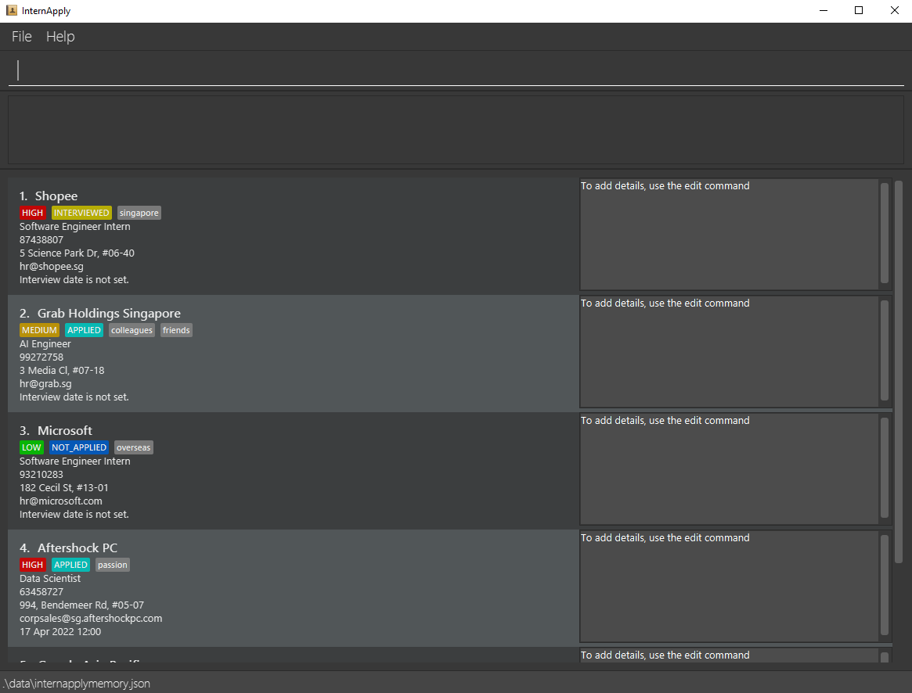

SoC InternApply (SIA) is a **desktop app for managing applications, optimized for use via a Command Line Interface** (CLI) while still having the benefits of a Graphical User Interface (GUI). If you can type fast, SIA can get your contact management tasks done faster than traditional GUI apps.

* Table of Contents
{:toc}

--------------------------------------------------------------------------------------------------------------------

## Quick start

1. Ensure you have Java `11` or above installed in your Computer.

1. Download the latest `InternApply.jar` from [here](https://github.com/AY2122S2-CS2103T-T11-3/tp/releases).

1. Copy the file to the folder you want to use as the _home folder_ for your SIA.

1. Double-click the file to start the app. The GUI similar to the below should appear in a few seconds. Note how the app contains some sample data. 
   

1. Type the command in the command box and press Enter to execute it. e.g. typing **`help`** and pressing Enter will open the help window. 
   Some example commands you can try:

   * **`list`** : Lists all contacts.

   * **`add`**`n/Shopee j/Software Engineer Intern p/87438807 e/hr@shopee.sg a/5 Science Park Dr, #06-40 t/Software Engineering` : Adds an application with company named `Shopee` to SIA.
   
   * **``edit``**`1 idt/17-03-2022 16:00` : Update the interview slot to `17 Mar 2022 16:00` for the first application on the list.

   * **`delete`**`3` : Deletes the 3rd application shown in the current list.

   * **`clear`** : Deletes all applications.

   * **`exit`** : Exits the app.

1. Refer to the [Features](#features) below for details of each command.

--------------------------------------------------------------------------------------------------------------------

## Features

**:information_source: Notes about the command format:** 

* Words in `UPPER_CASE` are the parameters to be supplied by the user. 
  e.g. in `add n/NAME`, `NAME` is a parameter which can be used as `add n/John Doe`.

* Items in square brackets are optional. 
  e.g `n/NAME [t/TAG]` can be used as `n/John Doe t/friend` or as `n/John Doe`.

* Items with `…`​ after them can be used multiple times including zero times. 
  e.g. `[t/TAG]…​` can be used as ` ` (i.e. 0 times), `t/friend`, `t/friend t/family` etc.

* Parameters can be in any order. 
  e.g. if the command specifies `n/NAME p/PHONE_NUMBER`, `p/PHONE_NUMBER n/NAME` is also acceptable.

* If a parameter is expected only once in the command but you specified it multiple times, only the last occurrence of the parameter will be taken. 
  e.g. if you specify `p/12341234 p/56785678`, only `p/56785678` will be taken.

* Extraneous parameters for commands that do not take in parameters (such as `help`, `list`, `exit` and `clear`) will be ignored. 
  e.g. if the command specifies `help 123`, it will be interpreted as `help`.

### Viewing help : `help`

Shows a message explaining how to access the help page.

<!--  -->

Format: `help`

### Adding an application: `add`

Adds an application to SoC InternApply.

Format: `add n/NAME_OF_COMPANY p/PHONE_NUMBER a/ADDRESS j/JOB_TITLE e/EMAIL [t/TAG]... [pt/PRIORITY_TAG] [ast/APPLICATION_STATUS_TAG]`

**Note:** `[t/TAG]`, `[pt/PRIORITY_TAG]` and `[ast/APPLICATION_STATUS_TAG]` are optional. 
* For `[pt/PRIORITY_TAG]`, user input can be any of: `HIGH`, `MEDIUM`, `LOW`
* For `[ast/APPLICATION_STATUS_TAG]`, user input can be any of: `NOT_APPLIED`, `APPLIED`, `INTERVIEWED`, `REJECTED`, `ACCEPTED`
* For the above 2 statements, the inputs are case-insensitive, i.e. `Applied`, `APPLIED` or `applied` are all accepted.

Examples:
* `add n/Shopee j/Software Engineer Intern p/87438807 e/hr@shopee.sg a/5 Science Park Dr, #06-40 t/Software Engineering `
* `add n/Shopee j/Software Engineer Intern p/87438807 e/hr@shopee.sg a/5 Science Park Dr, #06-40 t/Software Engineering pt/HIGH ast/APPLIED`

### Listing all applications : `list`

Shows a list of all applications in SoC InternApply.

Format: `list`

### Editing an application : `edit`

Edits an existing application in SoC InternApply.

Format: `edit INDEX [n/NAME] [j/JOB_TITLE] [p/PHONE_NUMBER] [e/EMAIL] [a/ADDRESS] [idt/INTERVIEW_DATE_TIME] [t/TAG]... \
[pt/PRIORITY_TAG] [ast/APPLICATION STATUS_TAG]`
- Edits the application at the specified `INDEX`. The index refers to the index number shown in the displayed peron list. The index **must be a positive integer** 1, 2, 3, ...
- At least one of the optional fields must be provided.
- Existing values will be updated to the input values.
- When editing `TAG`'s, the existing tags of the application will be removed.
- You can add an interview slot that includes both date and time by using the `idt/INTERVIEW_DATE_TIME`
- The interview date time, `INTERVIEW_DATE_TIME`, must in the follow format `dd-MM-yyyy HH:mm`.
- You can remove all the person's `TAG`'s by typing `t/` without specifying any tags after it.
- You can remove `INTERVIEW_DATE_TIME` by typing `idt/` without specifying any tags after it.

Examples:
- `edit 1 e/SoCStudent@example.com n/John Doe` Edits the email and name of the 1st application to be `SoCStudent@example.com` and `John Doe` respectively.
- `edit 2 j/Intern idt/` Edits the job title of the 2nd application to be `Intern` and clears the existing interview date time.

### Deleting a person : `delete`

Deletes the specified application from SoC InternApply.

Format: `delete INDEX`

* Deletes the application at the specified `INDEX`.
* The index refers to the index number shown in the displayed application list.
* The index **must be a positive integer** 1, 2, 3, …​

Examples:
* `list` followed by `delete 2` deletes the 2nd application.

### Clearing all entries : `clear`

Clears all entries from SoC InternApply.

Format: `clear`

### Exiting the program : `exit`

Exits the program.

Format: `exit`

### Saving the data

InternApply data are saved in the hard disk automatically after any command that changes the data. There is no need to save manually.

_More features coming soon ..._

--------------------------------------------------------------------------------------------------------------------

## FAQ

**Q**: How do I transfer my data to another Computer? 
**A**: Install the app in the other computer and overwrite the empty data file it creates with the file that contains the data of your previous SoC InternApply home folder.

--------------------------------------------------------------------------------------------------------------------

## Command summary

Action | Format, Examples
--------|------------------
**Add** | `add <NAME_OF_COMPANY> <JOB_TITLE> <EMAIL> [<STATUS>]`   e.g., `add n/Singtel j/UIUX Intern e/betsycrowe@example.com s/Applied`
**Clear** | `clear`
**Delete** | `delete INDEX`  e.g., `delete 3`
**List** | `list`
**Help** | `help`
